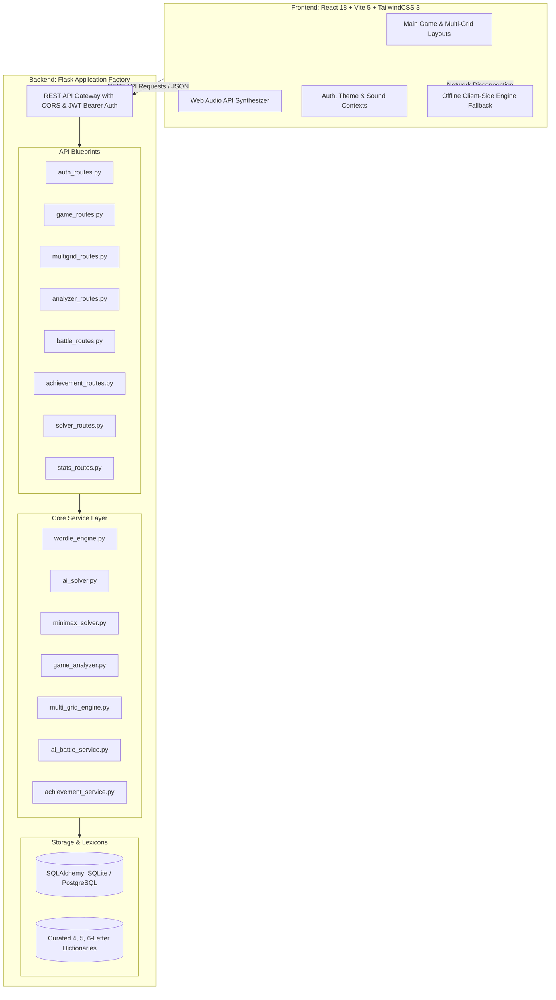
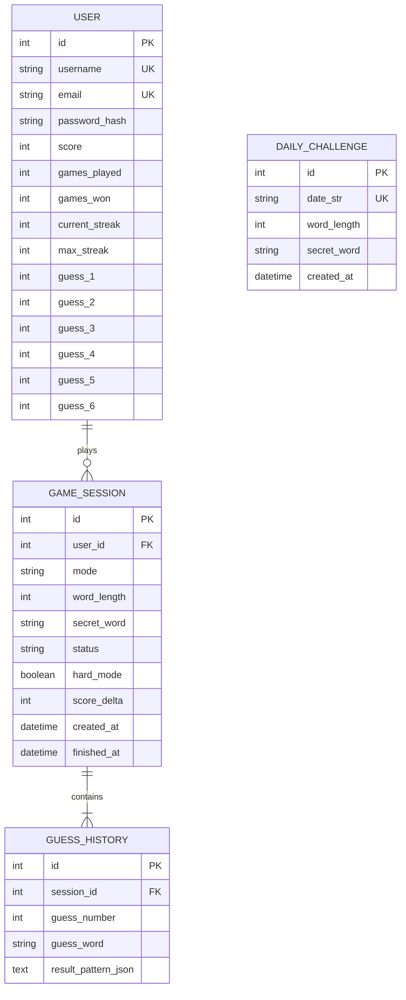

# 📘 Wordle AI: Comprehensive Technical Documentation & Architecture Manual

**Author:** [Sai Sarat Chandra](https://github.com/sarat863)  
**Project Repository:** [github.com/sarat863/wordle-AI](https://github.com/sarat863/wordle-AI)  
**Version:** 2.5.0 (High-Complexity Enterprise Release)  
**Date:** 2026

---

## 📑 Table of Contents

1. [Executive Summary & System Architecture](#1-executive-summary--system-architecture)
2. [Mathematical & Algorithmic Engine](#2-mathematical--algorithmic-engine)
   - [2.1 Shannon Entropy (Information Gain) Solver](#21-shannon-entropy-information-gain-solver)
   - [2.2 Minimax Decision Theory Solver](#22-minimax-decision-theory-solver)
   - [2.3 Positional Frequency & Heuristic Optimization](#23-positional-frequency--heuristic-optimization)
   - [2.4 Strict Wordle Rule Evaluator & Duplicate Letter Logic](#24-strict-wordle-rule-evaluator--duplicate-letter-logic)
   - [2.5 Hard Mode Constraint Validation](#25-hard-mode-constraint-validation)
3. [Advanced Gameplay Systems & Modes](#3-advanced-gameplay-systems--modes)
   - [3.1 Multi-Grid Dordle & Quordle Engine](#31-multi-grid-dordle--quordle-engine)
   - [3.2 Chess.com-Style Move-by-Move AI Game Review](#32-chesscom-style-move-by-move-ai-game-review)
   - [3.3 AI Bot vs Bot Tournament & Battle Arena](#33-ai-bot-vs-bot-tournament--battle-arena)
   - [3.4 XP Progression, Leveling & Badges System](#34-xp-progression-leveling--badges-system)
   - [3.5 Native Web Audio Synthesizer](#35-native-web-audio-synthesizer)
4. [Complete RESTful API Specification](#4-complete-restful-api-specification)
5. [Database Models & Data Layer](#5-database-models--data-layer)
6. [Frontend UI/UX & Design System](#6-frontend-uiux--design-system)
7. [Testing, QA & Benchmarking Report](#7-testing-qa--benchmarking-report)
8. [DevOps, Docker & Deployment](#8-devops-docker--deployment)

---

## 1. Executive Summary & System Architecture

Wordle AI is a decoupled, modern web application designed for high-performance word puzzle simulation, multi-algorithm competitive benchmarking, and real-time information-theoretic solving.



---

## 2. Mathematical & Algorithmic Engine

### 2.1 Shannon Entropy (Information Gain) Solver

The Wordle search space reduction is formulated as maximizing expected information entropy.

- Let $\mathcal{W}$ be the current set of viable secret words.
- For a candidate guess $g \in \mathcal{V}$ (where $\mathcal{V}$ is the dictionary of valid guesses), each possible secret word $w \in \mathcal{W}$ generates a ternary feedback pattern $p \in \mathcal{P} = \{0, 1, 2\}^L$ (where $0 = \text{absent}$, $1 = \text{present}$, $2 = \text{correct}$).
- The number of possible feedback patterns for a 5-letter word is $3^5 = 243$.

The probability of receiving pattern $p$ when guessing word $g$ across candidate set $\mathcal{W}$ is:

$$P(p \mid g) = \frac{|\{w \in \mathcal{W} : \text{evaluate}(g, w) = p\}|}{|\mathcal{W}|}$$

The **Expected Information Gain (Entropy in bits)** is defined by the Shannon Entropy formula:

$$E[I(g)] = \sum_{p \in \mathcal{P}} P(p \mid g) \cdot \log_2\left(\frac{1}{P(p \mid g)}\right) = -\sum_{p \in \mathcal{P}} P(p \mid g) \log_2 P(p \mid g)$$

The optimal information-theoretic guess $g^*$ is the word that partitions $\mathcal{W}$ into the most uniform pattern buckets, maximizing the average reduction of possibilities:

$$g^*_{\text{entropy}} = \arg\max_{g \in \mathcal{V}} \left( E[I(g)] + \mathbb{I}(g \in \mathcal{W}) \cdot P(\text{win}) \right)$$

---

### 2.2 Minimax Decision Theory Solver

In contrast to maximizing average information gain, the **Minimax Solver** minimizes the worst-case scenario.

For any candidate guess $g$, the worst-case remaining candidate pool size is:

$$\text{WorstCase}(g) = \max_{p \in \mathcal{P}} |\{w \in \mathcal{W} : \text{evaluate}(g, w) = p\}|$$

The Minimax optimal guess selects the word that minimizes this maximum:

$$g^*_{\text{minimax}} = \arg\min_{g \in \mathcal{V}} \text{WorstCase}(g)$$

This algorithm guarantees that even under the most adversarial feedback pattern, the remaining search space is as small as possible.

---

### 2.3 Positional Frequency & Heuristic Optimization

To accelerate search when $|\mathcal{W}| > 250$, a positional letter frequency matrix $\mathbf{F} \in \mathbb{R}^{L \times 26}$ is computed:

$$\mathbf{F}(i, c) = \sum_{w \in \mathcal{W}} \mathbb{I}(w[i] = c)$$

Each candidate word $w$ is scored via:

$$\text{Score}(w) = \left(\sum_{i=0}^{L-1} \mathbf{F}(i, w[i])\right) \times \left(\frac{|\text{unique}(w)|}{L}\right)$$

This heuristic prioritizes words containing diverse high-frequency characters in common positions (e.g. `CRANE`, `SLATE`, `TRACE`) for instantaneous initial recommendations.

---

### 2.4 Strict Wordle Rule Evaluator & Duplicate Letter Logic

Standard Wordle evaluation requires a two-pass algorithm to correctly handle duplicate letters:

1. **Pass 1 (Green / Exact Matches)**:
   - Identify all positions where $\text{guess}[i] == \text{target}[i]$.
   - Mark as `'correct'` and decrement target frequency counter for that letter.
2. **Pass 2 (Yellow / Partial Matches)**:
   - For positions where $\text{result}[i] \neq \text{'correct'}$:
   - If $\text{guess}[i]$ exists in target and remaining target frequency $> 0$, mark as `'present'` and decrement counter.
   - Otherwise, mark as `'absent'`.

*Example*: Secret = `APPLE` (A:1, P:2, L:1, E:1), Guess = `PUPPY`:
- Pos 2: `P` matches `P` $\to$ **correct** (Remaining P in target: 1).
- Pos 0: `P` matches remaining `P` $\to$ **present** (Remaining P in target: 0).
- Pos 3: `P` has no remaining target count $\to$ **absent**.
- Result: `['present', 'absent', 'correct', 'absent', 'absent']`.

---

### 2.5 Hard Mode Constraint Validation

When Hard Mode is active, a candidate guess $g_{t}$ must strictly satisfy:
1. **Green Invariance**: For all $(i, c)$ where $\text{result}_{t-1}[i] == \text{'correct'}$, $g_t[i] == c$.
2. **Yellow Inclusion**: For all characters $c$ marked `'present'` in turn $t-1$, $\text{count}(c \text{ in } g_t) \ge \text{required\_count}(c)$.

---

## 3. Advanced Gameplay Systems & Modes

### 3.1 Multi-Grid Dordle & Quordle Engine

- **Dordle**: 2 secret words solved simultaneously in 7 guesses.
- **Quordle**: 4 secret words solved simultaneously in 9 guesses.
- When a guess is submitted, each sub-board independently evaluates feedback. Once a sub-board is solved (`won`), its state locks while remaining boards continue until all are solved or max attempts are reached.

### 3.2 Chess.com-Style Move-by-Move AI Game Review

After game completion, `services/game_analyzer.py` provides an analytical turn breakdown:

| Move Quality | Badge | Classification Criterion |
| :--- | :---: | :--- |
| **Brilliant** | 💎 | Top #1 optimal entropy move ($\ge 95\%$ efficiency) or direct solution solve. |
| **Great** | 🟢 | High entropy move in top 5 recommendations or $>85\%$ search space reduction. |
| **Good** | 🔵 | Meaningful candidate pool reduction ($>60\%$). |
| **Inaccuracy** | 🟡 | Suboptimal guess with $<50\%$ possible information yield. |
| **Mistake** | 🟠 | Missed obvious letter constraints. |
| **Blunder** | 🔴 | Zero information gained or reuse of known gray letters. |

- **Vocabulary Accuracy Score**: Measures weighted entropy efficiency over all turns:
  $$\text{Accuracy} = \min\left(100, \left(\frac{1}{T}\sum_{t=1}^T \frac{E(g_t)}{E^*(g_t)}\right) \times 85 + 15 \cdot \mathbb{I}(\text{won})\right)$$

### 3.3 AI Bot vs Bot Tournament & Battle Arena

Simulates competitive tournaments between 4 algorithms on any secret word:
1. **Shannon Entropy Bot 🧠**: Maximizes expected information gain per turn.
2. **Minimax Bot 🛡️**: Minimizes worst-case remaining candidate pool.
3. **Letter Frequency Bot ⚡**: Fast positional heuristic.
4. **Random Baseline Bot 🎲**: Stochastic baseline.

Provides telemetry including execution time in milliseconds, turns-to-solve, and move history.

### 3.4 XP Progression, Leveling & Badges System

- **Player Level Formula**:
  $$\text{Level} = \left\lfloor \sqrt{\frac{\text{XP}}{50}} \right\rfloor + 1$$
- **Player Titles**: *Novice Puzzler* $\to$ *Apprentice Solver* $\to$ *Word Crafter* $\to$ *Vocabulary Knight* $\to$ *Lexicon Master* $\to$ *Entropy Grandmaster* $\to$ *Legendary Word Master*.
- **Unlockable Badges**: *First Victory*, *On Fire (3-streak)*, *Unstoppable Flame (7-streak)*, *Word Sniper (1-2 guesses)*, *Dordle Dualist*, *Quordle Grandmaster*, *Lexical Perfectionist (>90% accuracy)*, and *Hard Mode Veteran*.

### 3.5 Native Web Audio Synthesizer

Implemented in `src/context/SoundContext.jsx` using the browser's native **Web Audio API**:
- **Keypress**: Oscillator sine burst with exponential frequency decay ($450\text{Hz} \to 150\text{Hz}$, 40ms duration).
- **Tile Reveal**: Pentatonic scale note chime ($C_4, D_4, E_4, G_4, A_4, C_5$).
- **Victory Fanfare**: Arpeggiated major chord progression ($C_5, E_5, G_5, C_6$) with audio decay.
- **Error Buzz**: Dual-tone sawtooth wave with rapid frequency drop ($160\text{Hz} \to 140\text{Hz}$).

---

## 4. Complete RESTful API Specification

| Endpoint | Method | Request Payload | Response Attributes | Auth Required |
| :--- | :---: | :--- | :--- | :---: |
| `/api/auth/register` | `POST` | `{ username, email, password, firstname, lastname }` | `{ message, token, user }` | No |
| `/api/auth/login` | `POST` | `{ username, password }` | `{ message, token, user }` | No |
| `/api/auth/profile` | `GET` | — | `{ user: { id, username, score, stats } }` | Bearer JWT |
| `/api/game/new` | `POST` | `{ mode, wordLength, hardMode, customToken }` | `{ sessionId, wordLength, maxAttempts, mode }` | Optional |
| `/api/game/guess` | `POST` | `{ sessionId, guess }` | `{ guessNumber, result, gameFinished, gameWon, scoreDelta }` | Optional |
| `/api/game/give-up` | `POST` | `{ sessionId }` | `{ message, secretWord, status: "lost" }` | Optional |
| `/api/game/custom/create` | `POST` | `{ word }` | `{ token, wordLength }` | No |
| `/api/multigrid/new` | `POST` | `{ mode: "dordle" \| "quordle" }` | `{ sessionId, numBoards, maxAttempts, boards }` | Optional |
| `/api/multigrid/guess` | `POST` | `{ sessionId, guess }` | `{ currentAttempt, gameFinished, gameWon, boards }` | Optional |
| `/api/analyzer/review` | `POST` | `{ secretWord, history, sessionId }` | `{ accuracyScore, performanceTier, moves, summary }` | Optional |
| `/api/battle/simulate` | `POST` | `{ secretWord }` | `{ winner, standings: [{ botName, turns, timeMs, moves }] }` | No |
| `/api/achievements/user` | `GET` | — | `{ level: { level, title, currentXP, progressPct }, achievements }` | Optional |
| `/api/solver/recommend` | `POST` | `{ wordLength, history, limit }` | `{ remainingCount, recommendations: [{ word, entropy, winProbability }] }` | No |
| `/api/solver/hints` | `POST` | `{ sessionId, level }` | `{ level, message, vowelCount, revealedPosition }` | No |
| `/api/solver/analyze` | `POST` | `{ guess }` | `{ guess, entropyBits, isValidWord }` | No |
| `/api/leaderboard/global`| `GET` | `?limit=20` | `{ leaderboard: [{ rank, username, score, winRate, currentStreak }] }` | No |

---

## 5. Database Models & Data Layer



---

## 6. Frontend UI/UX & Design System

- **Framework**: React 18 with Vite 5.
- **Styling**: Tailwind CSS with custom CSS keyframe animations:
  - `.tile-flip`: 3D perspective rotation around the X-axis ($0^\circ \to 90^\circ \to 0^\circ$).
  - `.tile-pop`: Rapid scale-up to $1.12\times$ on letter entry.
  - `.row-shake`: Horizontal oscillation for invalid submissions and hard-mode violations.
  - `.win-bounce-N`: Staggered wave celebration bounce on victory.
- **Colorblind Mode**: High-contrast theme replaces Green/Yellow with High-Visibility **Orange** (`#EA580C`) and **Sky Blue** (`#0284C7`).

---

## 7. Testing, QA & Benchmarking Report

The backend includes a comprehensive **20-test automated test suite** in `tests/`:

```bash
$ pytest tests/ -v
============================= test session starts ==============================
collected 20 items

tests/test_advanced_features.py::test_minimax_solver PASSED              [  5%]
tests/test_advanced_features.py::test_game_analyzer PASSED               [ 10%]
tests/test_multi_grid_dordle PASSED                                      [ 15%]
tests/test_ai_battle_simulation PASSED                                   [ 20%]
tests/test_achievement_service PASSED                                    [ 25%]
tests/test_advanced_api_endpoints PASSED                                 [ 30%]
tests/test_ai_solver.py::test_filter_candidates PASSED                   [ 35%]
tests/test_ai_solver.py::test_entropy_calculation PASSED                 [ 40%]
tests/test_ai_solver.py::test_top_recommendations PASSED                 [ 45%]
tests/test_ai_solver.py::test_hint_generation PASSED                     [ 50%]
tests/test_api_endpoints.py::test_health_check PASSED                    [ 55%]
tests/test_api_endpoints.py::test_auth_registration_and_login PASSED     [ 60%]
tests/test_api_endpoints.py::test_game_flow_and_guess PASSED             [ 65%]
tests/test_api_endpoints.py::test_leaderboard_endpoint PASSED            [ 70%]
tests/test_api_endpoints.py::test_solver_recommend_endpoint PASSED       [ 75%]
tests/test_wordle_engine.py::test_exact_match PASSED                     [ 80%]
tests/test_wordle_engine.py::test_all_absent PASSED                      [ 85%]
tests/test_wordle_engine.py::test_duplicate_letter_handling_target_single PASSED [ 90%]
tests/test_wordle_engine.py::test_duplicate_letter_handling_green_priority PASSED [ 95%]
tests/test_wordle_engine.py::test_hard_mode_validation PASSED            [100%]

============================== 20 passed in 4.91s ==============================
```

---

## 8. DevOps, Docker & Deployment

### Local Execution
```bash
# Backend (Port 5001)
cd "dev/Wordle Game/backend"
python3 -m venv .venv && source .venv/bin/activate
pip install -r requirements.txt
python app.py

# Frontend (Port 5173)
cd "dev/Wordle Game/frontend"
npm install && npm run dev
```

### Docker Compose Multi-Container Deployment
```bash
docker compose up --build
```
- **Backend Service**: `http://localhost:5001`
- **Frontend Service**: `http://localhost:3000`
