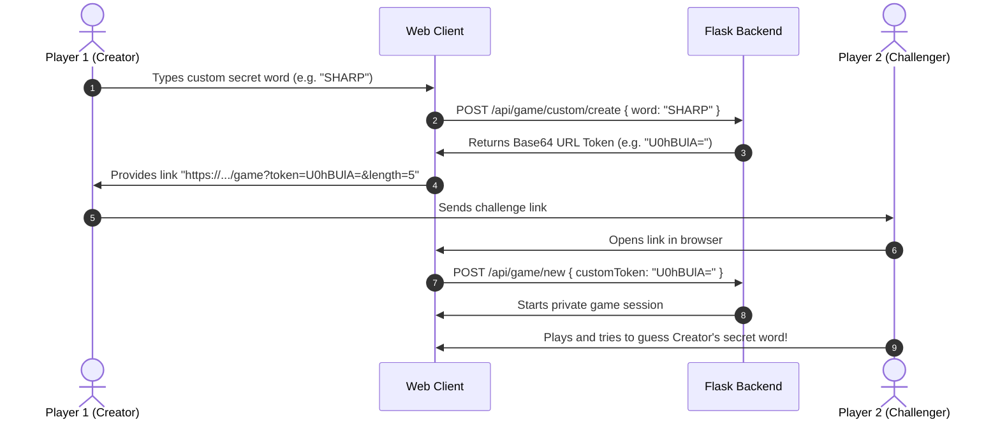

# 🎮 Wordle AI: Complete Game Modes, Puzzles & Systems Guide

**Author:** [Sai Sarat Chandra](https://github.com/sarat863)  
**Project:** [Wordle AI Platform](https://github.com/sarat863/wordle-AI)

This comprehensive guide details the mechanics, mathematical strategies, visual layouts, and system wiring for every puzzle mode and AI module within the Wordle AI platform.

---

## 📑 Game Modes & Puzzles Index

1. [Classic Practice Mode (5 Letters) ♾️](#1-classic-practice-mode-5-letters-️)
2. [Daily Challenge Mode 📅](#2-daily-challenge-mode-)
3. [Dordle: 2-Board Simultaneous Solving 👥](#3-dordle-2-board-simultaneous-solving-)
4. [Quordle: 4-Board Simultaneous Solving 👑](#4-quordle-4-board-simultaneous-solving-)
5. [Speed Run Mode (3-Minute Sprint) ⚡](#5-speed-run-mode-3-minute-sprint-)
6. [Variable Length: 4-Letter Mini & 6-Letter Master 4️⃣ 6️⃣](#6-variable-length-4-letter-mini--6-letter-master-4️⃣-6️⃣)
7. [Custom Multiplayer Friend Challenge 🔗](#7-custom-multiplayer-friend-challenge-)
8. [Chess.com-Style Move-by-Move AI Game Review 💎](#8-chesscom-style-move-by-move-ai-game-review-)
9. [AI Bot vs Bot Tournament & Battle Arena ⚔️](#9-ai-bot-vs-bot-tournament--battle-arena-⚔️)
10. [Player XP Progression, Leveling & Badges 🎖️](#10-player-xp-progression-leveling--badges-️)
11. [In-Game Vocabulary Dictionary Inspector 📖](#11-in-game-vocabulary-dictionary-inspector-)

---

## 1. Classic Practice Mode (5 Letters) ♾️

### 🎯 Objective
Guess the secret 5-letter hidden word within **6 attempts**.

### 🧩 Rules & Feedback Mechanics
Each guess must be a valid 5-letter English word. After submitting:
- 🟩 **Green (Correct)**: The letter is in the correct position.
- 🟨 **Yellow (Present)**: The letter is in the target word but at a different position.
- ⬛ **Gray (Absent)**: The letter does not appear in the target word (or exceeds its frequency count).

### 📐 UI Wireframe & Layout
```text
┌──────────────────────────────────────────────┐
│  [W] Wordle AI     [♾️ Practice (5L) ▼]  [AI] │
├──────────────────────────────────────────────┤
│                                              │
│               [ C ][ R ][ A ][ N ][ E ]      │  (Row 1: Guessed)
│               [ S ][ L ][ A ][ T ][ E ]      │  (Row 2: Guessed)
│               [   ][   ][   ][   ][   ]      │  (Row 3: Active)
│               [   ][   ][   ][   ][   ]      │  (Row 4: Empty)
│               [   ][   ][   ][   ][   ]      │  (Row 5: Empty)
│               [   ][   ][   ][   ][   ]      │  (Row 6: Empty)
│                                              │
│       [Q][W][E][R][T][Y][U][I][O][P]         │
│        [A][S][D][F][G][H][J][K][L]           │
│       [ENTER] [Z][X][C][V][B][N][M] [⌫]      │
└──────────────────────────────────────────────┘
```

### 🧠 Mathematical Strategy
- **Opening Move**: Play words with high expected Shannon Entropy like `CRANE` (5.87 bits) or `SLATE` (5.86 bits).
- **Candidate Pruning**: Narrow the search space from 2,315 candidates to $<50$ in 2 guesses.

---

## 2. Daily Challenge Mode 📅

### 🎯 Objective
Solve the synchronized daily puzzle that is identical for every player worldwide on that calendar date.

### 🧩 Rules & System Wiring
- **Deterministic Seed**: The secret word is selected deterministically based on UTC date string `YYYY-MM-DD` using a cryptographic modulo hash:
  $$\text{Index} = \text{SHA256}(\text{DateString}) \pmod{|\text{TargetWords}|}$$
- **Streak Protection**: Maintains global win streaks and daily participation stats.

---

## 3. Dordle: 2-Board Simultaneous Solving 👥

### 🎯 Objective
Solve **two different 5-letter secret words simultaneously** within **7 attempts**.

### 🧩 Rules & Dual-Grid Mechanics
- Every guess you type is evaluated **concurrently on both Board 1 and Board 2**.
- When Board 1 is solved, it locks as `won`, and subsequent guesses continue evaluating on Board 2 until both are solved or attempts run out.

### 📐 UI Wireframe & Layout
```text
┌─────────────────────────────────────────────────────────────┐
│  [W] Wordle AI          [👥 Dordle (2 Boards) ▼]      [AI]   │
├─────────────────────────────────────────────────────────────┤
│                                                             │
│       BOARD 1 (Solved in 3)           BOARD 2 (In Progress) │
│     ┌───────────────────────┐       ┌─────────────────────┐ │
│     │ [ C ][ R ][ A ][ N ][E]│       │ [ C ][ R ][ A ][N][E]│ │
│     │ [ T ][ R ][ A ][ C ][E]│       │ [ S ][ P ][ O ][K][E]│ │
│     │ [ G ][ R ][ A ][ P ][E]│ (✅)  │ [ F ][ L ][ A ][M][E]│ │
│     │                       │       │ [ _ ][ _ ][ _ ][_][_]│ │
│     │                       │       │ [ _ ][ _ ][ _ ][_][_]│ │
│     │                       │       │ [ _ ][ _ ][ _ ][_][_]│ │
│     │                       │       │ [ _ ][ _ ][ _ ][_][_]│ │
│     └───────────────────────┘       └─────────────────────┘ │
│                                                             │
│               [Q][W][E][R][T][Y][U][I][O][P]                │
│                [A][S][D][F][G][H][J][K][L]                  │
│               [ENTER] [Z][X][C][V][B][N][M] [⌫]             │
└─────────────────────────────────────────────────────────────┘
```

### 🧠 Dual-Board Strategy
- **Phase 1 (Turns 1–2)**: Play distinct vowel-rich explorative words (`CRANE`, `PILOT`) to gather clues across both boards.
- **Phase 2 (Turns 3–5)**: Focus first on the board with fewer remaining candidates, solve it, then use remaining guesses on the second board.

---

## 4. Quordle: 4-Board Simultaneous Solving 👑

### 🎯 Objective
Solve **four distinct 5-letter secret words simultaneously** within **9 attempts**.

### 🧩 Rules & Quad-Grid Mechanics
- Single input stream feeds into 4 separate boards (Top-Left, Top-Right, Bottom-Left, Bottom-Right).
- Requires high-efficiency information-gathering opening moves to satisfy all 4 target words before running out of guesses.

### 📐 UI Wireframe & Layout
```text
┌─────────────────────────────────────────────────────────────┐
│  [W] Wordle AI         [👑 Quordle (4 Boards) ▼]      [AI]  │
├─────────────────────────────────────────────────────────────┤
│   BOARD 1 (Top-Left)               BOARD 2 (Top-Right)      │
│   ┌─────────────────────┐          ┌─────────────────────┐  │
│   │ [T][R][A][C][E] (🟡)│          │ [T][R][A][C][E] (🟢)│  │
│   │ [G][R][A][P][E] (✅)│          │ [ _ ][ _ ][ _ ][ _ ]│  │
│   └─────────────────────┘          └─────────────────────┘  │
│   BOARD 3 (Bottom-Left)            BOARD 4 (Bottom-Right)   │
│   ┌─────────────────────┐          ┌─────────────────────┐  │
│   │ [T][R][A][C][E] (⬛)│          │ [T][R][A][C][E] (🟡)│  │
│   │ [ _ ][ _ ][ _ ][ _ ]│          │ [ _ ][ _ ][ _ ][ _ ]│  │
│   └─────────────────────┘          └─────────────────────┘  │
│                                                             │
│               [Q][W][E][R][T][Y][U][I][O][P]                │
│                [A][S][D][F][G][H][J][K][L]                  │
│               [ENTER] [Z][X][C][V][B][N][M] [⌫]             │
└─────────────────────────────────────────────────────────────┘
```

---

## 5. Speed Run Mode (3-Minute Sprint) ⚡

### 🎯 Objective
Solve the puzzle before the **180-second countdown timer** expires.

### 🧩 Mechanics
- Real-time animated ticking clock banner.
- High-stakes scoring: Score bonus is multiplied by remaining seconds.
- If the timer hits zero, the game terminates automatically.

---

## 6. Variable Length: 4-Letter Mini & 6-Letter Master 4️⃣ 6️⃣

### 4-Letter Mini Mode (4️⃣)
- **Grid**: $6 \times 4$ layout.
- **Search Space**: ~1,800 common 4-letter words.
- **Gameplay**: Fast-paced, tactical sprint.

### 6-Letter Master Mode (6️⃣)
- **Grid**: $6 \times 6$ layout.
- **Search Space**: ~4,500 6-letter words.
- **Gameplay**: Advanced combinatorial depth requiring sophisticated prefix/suffix analysis (e.g. `-ING`, `-TION`, `RE-`, `UN-`).

---

## 7. Custom Multiplayer Friend Challenge 🔗

### 🎯 Objective
Create a custom secret word challenge and share an encrypted URL with friends.

### 🧩 Workflow & Cryptography


---

## 8. Chess.com-Style Move-by-Move AI Game Review 💎

### 🎯 Objective
Post-match deep information-theoretic evaluation of every move you made.

### 📐 Modal Wireframe & Accuracy Meter
```text
┌─────────────────────────────────────────────────────────────┐
│ 🧠 AI MOVE-BY-MOVE GAME REVIEW                          [✕] │
├─────────────────────────────────────────────────────────────┤
│  VOCABULARY PERFORMANCE                                     │
│  Grandmaster Accuracy                                94.2%  │
│  Secret Word: CRANE in 3 turns                      ACCURACY│
├─────────────────────────────────────────────────────────────┤
│  [ 💎 1 Brilliant ] [ 🟢 1 Great ] [ 🔵 1 Good ] [ 🔴 0 ]   │
├─────────────────────────────────────────────────────────────┤
│  #1 TRACE           [ 💎 Brilliant ]                        │
│     Optimal entropy opening play! Eliminated 98% space.     │
│     Candidates: 2,315 → 46 | Eliminated: 98.0% | Optimal: TRACE│
├─────────────────────────────────────────────────────────────┤
│  #2 SLATE           [ 🟢 Great ]                            │
│     High information yield move. Pruned candidates to 2.    │
│     Candidates: 46 → 2 | Eliminated: 95.6% | Optimal: CRANE │
├─────────────────────────────────────────────────────────────┤
│  #3 CRANE           [ 💎 Brilliant ]                        │
│     Exact match solve! 100% precision.                      │
│     Candidates: 2 → 1 | Eliminated: 100% | Optimal: CRANE   │
└─────────────────────────────────────────────────────────────┘
```

---

## 9. AI Bot vs Bot Tournament & Battle Arena ⚔️

### 🎯 Objective
Benchmarking 4 distinct mathematical and algorithmic AI strategies head-to-head on the same secret word.

### 🤖 The 4 Contenders
1. **Shannon Entropy Bot 🧠**:
   - Maximizes: $E[I(g)] = \sum P(p) \log_2 \frac{1}{P(p)}$.
   - Balances exploration across pattern partitions.
2. **Minimax Bot 🛡️**:
   - Minimizes: $\text{WorstCase}(g) = \max_p |\mathcal{W}_{g,p}|$.
   - Defensive strategy minimizing worst-case uncertainty.
3. **Letter Frequency Bot ⚡**:
   - Scores words based on positional frequency matrix $\mathbf{F}$.
   - Fast, lightweight heuristic execution.
4. **Random Baseline Bot 🎲**:
   - Selects randomly from remaining candidate words.
   - Stochastic control baseline.

---

## 10. Player XP Progression, Leveling & Badges 🎖️

### 📈 Leveling Formula
$$\text{Level} = \left\lfloor \sqrt{\frac{\text{XP}}{50}} \right\rfloor + 1$$

| Level | Title | XP Required |
| :---: | :--- | :---: |
| **1** | Novice Puzzler | 0 – 49 XP |
| **2** | Apprentice Solver | 50 – 199 XP |
| **3** | Word Crafter | 200 – 449 XP |
| **4** | Vocabulary Knight | 450 – 799 XP |
| **5** | Lexicon Master | 800 – 1,249 XP |
| **6** | Entropy Grandmaster | 1,250 – 1,799 XP |
| **7+** | Legendary Word Master | 1,800+ XP |

### 🏆 Unlockable Badges
- 🏆 **First Victory**: Win your very first Wordle puzzle (+50 XP).
- 🔥 **On Fire**: Maintain a 3-game winning streak (+100 XP).
- ⚡ **Unstoppable Flame**: Reach a 7-day winning streak (+250 XP).
- 🎯 **Word Sniper**: Guess the secret word in 1 or 2 attempts (+200 XP).
- 👥 **Dordle Dualist**: Conquer a 2-board simultaneous Dordle puzzle (+175 XP).
- 👑 **Quordle Grandmaster**: Solve all 4 boards in a Quordle match (+350 XP).
- 💎 **Lexical Perfectionist**: Achieve $>90\%$ accuracy in the AI Game Review (+200 XP).
- 🛡️ **Hard Mode Veteran**: Win a game with strict Hard Mode enabled (+150 XP).

---

## 11. In-Game Vocabulary Dictionary Inspector 📖

### 🎯 Objective
Immediate in-game vocabulary lookup providing phonetics, part of speech, definitions, and usage examples for any word guessed or revealed.

```text
┌─────────────────────────────────────────────────────────────┐
│ 📖 VOCABULARY DICTIONARY                                [✕] │
├─────────────────────────────────────────────────────────────┤
│  [ SEARCH: CRANE                                  ] [LOOKUP]│
├─────────────────────────────────────────────────────────────┤
│  CRANE                                                      │
│  /kreɪn/                                                    │
├─────────────────────────────────────────────────────────────┤
│  [ NOUN ]                                                   │
│  • A large, tall wading bird with long legs and a long neck │
│  • A machine used for lifting and moving heavy weights      │
│    "The builders operated the tower crane at the site."     │
├─────────────────────────────────────────────────────────────┤
│  [ VERB ]                                                   │
│  • To stretch out one's neck in order to see something      │
│    "She craned her neck to see through the window."         │
└─────────────────────────────────────────────────────────────┘
```

---

## 💻 Summary of Game System Wiring

| System Module | Backend Service | API Route | Frontend Component |
| :--- | :--- | :--- | :--- |
| **Core Game** | `wordle_engine.py` | `POST /api/game/guess` | `Board.jsx`, `Keyboard.jsx` |
| **Multi-Grid** | `multi_grid_engine.py` | `POST /api/multigrid/guess` | `MultiGridBoard.jsx` |
| **Entropy AI** | `ai_solver.py` | `POST /api/solver/recommend` | `HintsDrawer.jsx` |
| **Game Review** | `game_analyzer.py` | `POST /api/analyzer/review` | `GameReviewModal.jsx` |
| **Bot Arena** | `ai_battle_service.py` | `POST /api/battle/simulate` | `AIBattleModal.jsx` |
| **Progression**| `achievement_service.py` | `GET /api/achievements/user` | `AchievementsModal.jsx` |
| **Dictionary** | Free Dictionary API | Client REST Fetch | `DictionaryModal.jsx` |
| **Audio** | Web Audio API | Client Synthesizer | `SoundContext.jsx` |
