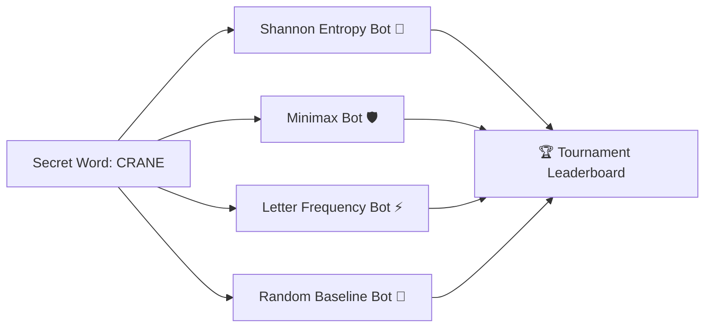

<div align="center">

# 🌟 Wordle AI: Enterprise Multi-Paradigm Puzzle Engine & Intelligent Solver Platform

**Architected & Developed by [Sai Sarat Chandra](https://github.com/sarat863)**

[](https://python.org)
[](https://flask.palletsprojects.com/)
[](https://reactjs.org/)
[](https://vitejs.dev/)
[](https://tailwindcss.com/)
[](https://pytest.org)
[](https://docker.com)
[](LICENSE)

*A full-stack, multi-paradigm Wordle ecosystem featuring mathematical solver engines (**Shannon Information Theory & Minimax**), Multi-Grid puzzle solving (**Dordle & Quordle**), a Chess.com-style **AI Move-by-Move Accuracy Reviewer**, a live **Bot vs Bot Tournament Arena**, and an **XP/Achievement Leveling System**.*

---

[🚀 Quick Start](#-quick-start-guide) • [🎮 Game Modes & Puzzles](#-game-modes--puzzles-catalog) • [🧠 Mathematical AI Solvers](#-mathematical-formulation-of-the-ai-solvers) • [🏛️ System Architecture](#-system-architecture) • [📡 RESTful API Reference](#-restful-api-reference) • [🧪 Testing](#-automated-testing-suite) • [📘 Detailed Manuals](#-detailed-documentation-links) • [👨‍💻 Author](#-author--contact)

---

</div>

## 📸 Key Features At A Glance

| Category | Highlight Features |
| :--- | :--- |
| 🧩 **Puzzle Paradigms** | **Classic Practice (5L)**, **Daily Challenge**, **Dordle (2 Boards)**, **Quordle (4 Boards)**, **Speed Run (3-Min)**, **4-Letter Mini**, **6-Letter Master**, and **Custom Friend Challenges**. |
| 🧠 **AI Intelligence** | **Shannon Information Entropy Solver** ($E[I]$ bits), **Minimax Worst-Case Pruning**, Tiered Character Hints, and Positional Frequency Heuristics. |
| 💎 **Game Analytics** | **Chess.com-Style Move-by-Move Review**: Classifies every turn as *Brilliant 💎*, *Great 🟢*, *Good 🔵*, *Inaccuracy 🟡*, *Mistake 🟠*, or *Blunder 🔴* with candidate elimination curves ($2,315 \to 46 \to 3 \to 1$). |
| ⚔️ **AI Battle Arena** | Head-to-head live benchmarking across 4 algorithms: Shannon Entropy Bot vs. Minimax Bot vs. Letter Frequency Bot vs. Random Baseline. |
| 🎖️ **Gamification** | Leveling progression ($\text{Level} = \lfloor \sqrt{\text{XP}/50} \rfloor + 1$), dynamic player titles (*Novice Puzzler* to *Grandmaster*), and 8 unlockable achievement badges. |
| 📖 **Lexical Tools** | In-game vocabulary inspector with phonetics, part of speech, definitions, and real-world example sentences. |
| 🔊 **Audio & A11y** | Zero-asset **Web Audio API synthesizer** (dynamic clicks, chords, chimes, and fanfares) & **Colorblind Mode** (Orange/Sky Blue). |

---

## 🎮 Game Modes & Puzzles Catalog

*For full deep-dives, wireframes, and strategic breakdowns, see [GAME_MODES.md](GAME_MODES.md).*

### 1. ♾️ Classic Practice Mode (5 Letters)
The definitive Wordle experience. Guess the hidden 5-letter word in **6 attempts** with real-time color feedback (🟩 Green = Correct, 🟨 Yellow = Present, ⬛ Gray = Absent) and strict duplicate letter evaluation.

### 2. 👥 Dordle: 2-Board Simultaneous Solving
Solve **two independent secret words simultaneously** within **7 attempts**. Your guesses feed into both grids concurrently. When one board is solved, it locks as `won`, while the second board remains active.

```text
┌─────────────────────────────────────────────────────────────┐
│  [W] Wordle AI          [👥 Dordle (2 Boards) ▼]      [AI]   │
├─────────────────────────────────────────────────────────────┤
│       BOARD 1 (Solved in 3)           BOARD 2 (In Progress) │
│     ┌───────────────────────┐       ┌─────────────────────┐ │
│     │ [ C ][ R ][ A ][ N ][E]│       │ [ C ][ R ][ A ][N][E]│ │
│     │ [ T ][ R ][ A ][ C ][E]│       │ [ S ][ P ][ O ][K][E]│ │
│     │ [ G ][ R ][ A ][ P ][E]│ (✅)  │ [ F ][ L ][ A ][M][E]│ │
│     │                       │       │ [ _ ][ _ ][ _ ][_][_]│ │
│     └───────────────────────┘       └─────────────────────┘ │
└─────────────────────────────────────────────────────────────┘
```

### 3. 👑 Quordle: 4-Board Simultaneous Solving
The ultimate multitasking puzzle. Solve **four distinct secret words simultaneously** within **9 attempts** across 4 quadrants.

### 4. ⚡ Speed Run Mode (3-Minute Sprint)
Race against an active **180-second ticking clock**. Score points proportionally to your remaining time, with penalties if the timer reaches zero.

### 5. 4️⃣ 4-Letter Mini & 6️⃣ 6-Letter Master Modes
- **4-Letter Mini**: Fast, compact $6 \times 4$ puzzle layout (~1,800 candidates).
- **6-Letter Master**: Combinatorial challenge with $6 \times 6$ layout (~4,500 candidates) requiring deep vocabulary prefixes/suffixes.

### 6. 📅 Daily Challenge Mode
Universal, date-seeded puzzle synchronized globally for all players each day using cryptographic hash modulo selection.

### 7. 🔗 Custom Multiplayer Friend Challenges
Create your own hidden secret word challenge, generate an encrypted shareable URL token (`/game?token=...`), and challenge friends to solve it.

---

## 💎 Chess.com-Style Move-by-Move AI Game Review

Click **"View AI Move-by-Move Review 💎"** after any game to view a comprehensive post-match analytics breakdown:

```text
┌─────────────────────────────────────────────────────────────┐
│ 🧠 AI MOVE-BY-MOVE GAME REVIEW                          [✕] │
├─────────────────────────────────────────────────────────────┤
│  VOCABULARY PERFORMANCE                                     │
│  Grandmaster Accuracy                                94.2%  │
│  Secret Word: CRANE in 3 turns                      ACCURACY│
├─────────────────────────────────────────────────────────────┤
│  [ 💎 1 Brilliant ] [ 🟢 1 Great ] [ 🔵 1 Good ] [ 🔴 0 ]   │
├─────────────────────────────────────────────────────────────┤
│  #1 TRACE   [ 💎 Brilliant ]                                │
│     Optimal entropy opening play! Eliminated 98% space.     │
│     Candidates: 2,315 → 46 | Eliminated: 98.0% | Optimal: TRACE│
├─────────────────────────────────────────────────────────────┤
│  #2 SLATE   [ 🟢 Great ]                                    │
│     High information yield move. Pruned candidates to 2.    │
│     Candidates: 46 → 2 | Eliminated: 95.6% | Optimal: CRANE │
└─────────────────────────────────────────────────────────────┘
```

---

## ⚔️ AI Bot vs Bot Tournament Arena

Benchmark 4 distinct algorithms head-to-head on any custom or random secret word with real-time compute telemetry:



- **Shannon Entropy Bot 🧠**: Maximizes expected information gain per turn.
- **Minimax Bot 🛡️**: Minimizes worst-case remaining candidate pool.
- **Letter Frequency Bot ⚡**: Rapid positional distribution scoring.
- **Random Baseline Bot 🎲**: Stochastic baseline model.

---

## 🧠 Mathematical Formulation of the AI Solvers

### 1. Shannon Information Entropy ($E[I]$)

Given a guess $g$, the current candidate set $\mathcal{W}$, and the 243 possible feedback patterns $\mathcal{P} = \{0, 1, 2\}^5$:

$$P(p \mid g) = \frac{|\{w \in \mathcal{W} : \text{evaluate}(g, w) = p\}|}{|\mathcal{W}|}$$

The **Expected Information Gain (Entropy in bits)** is computed as:

$$E[I(g)] = \sum_{p \in \mathcal{P}} P(p \mid g) \cdot \log_2\left(\frac{1}{P(p \mid g)}\right)$$

The optimal guess maximizes expected information:

$$g^*_{\text{entropy}} = \arg\max_{g \in \mathcal{V}} E[I(g)]$$

---

### 2. Minimax Worst-Case Pruning

The Minimax strategy minimizes the maximum possible remaining candidate pool size:

$$\text{WorstCase}(g) = \max_{p \in \mathcal{P}} |\{w \in \mathcal{W} : \text{evaluate}(g, w) = p\}|$$

$$g^*_{\text{minimax}} = \arg\min_{g \in \mathcal{V}} \text{WorstCase}(g)$$

---

## 🏛️ System Architecture

```mermaid
graph TD
    subgraph ClientLayer [Frontend: React 18 + Vite 5 + TailwindCSS 3]
        UI[Interactive Board & Responsive QWERTY Keyboard]
        MultiGridUI[Multi-Grid Layout: Dordle & Quordle]
        SolverDrawer[AI Solver & Hints Drawer]
        ReviewModal[Move-by-Move AI Game Review]
        BattleArena[Bot vs Bot Tournament Arena]
        AudioEngine[Web Audio API Sound Engine]
        OfflineEngine[Local Client-Side Fallback Engine]
    end

    subgraph GatewayLayer [Backend API: Flask Application Factory]
        API[RESTful API Gateway + CORS + Bearer Token Auth]
        AuthRouter[routes/auth_routes.py]
        GameRouter[routes/game_routes.py]
        MultiGridRouter[routes/multigrid_routes.py]
        SolverRouter[routes/solver_routes.py]
        AnalyzerRouter[routes/analyzer_routes.py]
        BattleRouter[routes/battle_routes.py]
        AchievementRouter[routes/achievement_routes.py]
        StatsRouter[routes/stats_routes.py]
    end

    subgraph ServiceLayer [Engine Services]
        WordleEngine[Strict Wordle Evaluator & Duplicate Letter Logic]
        EntropySolver[Shannon Entropy Information Theory Solver]
        MinimaxSolver[Minimax Worst-Case Pruning Solver]
        MultiGridService[Dordle & Quordle Engine]
        AnalyzerService[Game Review & Move Quality Classifier]
        BattleService[AI Tournament Simulation Runner]
        AchievementService[XP, Level & Badges Progression]
    end

    subgraph DataLayer [Data Persistence & Dictionaries]
        DB[(SQLAlchemy ORM: SQLite / PostgreSQL)]
        WordDicts[Target Words & Valid Dictionaries: 4, 5, 6 Letters]
    end

    UI -->|REST API + JWT| API
    UI -.->|Network Fallback| OfflineEngine
    API --> AuthRouter & GameRouter & MultiGridRouter & SolverRouter & AnalyzerRouter & BattleRouter & AchievementRouter & StatsRouter
    GameRouter --> WordleEngine
    MultiGridRouter --> MultiGridService
    SolverRouter --> EntropySolver & MinimaxSolver
    AnalyzerRouter --> AnalyzerService
    BattleRouter --> BattleService
    AchievementRouter --> AchievementService
    AuthRouter & StatsRouter --> DB
    ServiceLayer --> DB
    ServiceLayer --> WordDicts
```



---

## 📡 RESTful API Reference

| Endpoint | Method | Description | Auth |
| :--- | :---: | :--- | :---: |
| `/api/auth/register` | `POST` | Register user with bcrypt password hashing | No |
| `/api/auth/login` | `POST` | Authenticate user and issue JWT Bearer token | No |
| `/api/auth/profile` | `GET` | Get profile, score, and lifetime gameplay statistics | Yes |
| `/api/game/new` | `POST` | Initialize a game session (Daily, Practice, 4/5/6-letter) | Optional |
| `/api/game/guess` | `POST` | Submit guess with strict duplicate letter color evaluation | Optional |
| `/api/game/give-up` | `POST` | Forfeit active game and reveal secret word | Optional |
| `/api/game/custom/create` | `POST` | Generate encrypted token for friend challenge | No |
| `/api/multigrid/new` | `POST` | Start Dordle (2 boards) or Quordle (4 boards) match | Optional |
| `/api/multigrid/guess` | `POST` | Submit simultaneous guess across all active sub-boards | Optional |
| `/api/analyzer/review` | `POST` | Generate move-by-move accuracy review & candidate curve | Optional |
| `/api/battle/simulate` | `POST` | Run 4-bot head-to-head algorithm tournament simulation | No |
| `/api/achievements/user` | `GET` | Retrieve player XP, Level, and unlocked achievement badges | Optional |
| `/api/solver/recommend` | `POST` | Compute top moves ranked by Shannon Entropy | No |
| `/api/solver/hints` | `POST` | Retrieve tiered structural & character hints | No |
| `/api/solver/analyze` | `POST` | Analyze entropy bits for any custom test word | No |
| `/api/leaderboard/global`| `GET` | Retrieve global leaderboard ranked by score & streaks | No |

---

## 🚀 Quick Start Guide

### Prerequisites
- **Python 3.10+**
- **Node.js 18+ & npm**

### Option A: Local Development Setup

#### 1. Backend Server Setup
```bash
# Navigate to backend directory
cd "dev/Wordle Game/backend"

# Create and activate virtual environment
python3 -m venv .venv
source .venv/bin/activate  # On Windows: .venv\Scripts\activate

# Install dependencies
pip install -r requirements.txt

# Start backend server
python app.py
```
*Backend API will run on `http://127.0.0.1:5001`.*

#### 2. Frontend Web App Setup
```bash
# In a new terminal, navigate to frontend directory
cd "dev/Wordle Game/frontend"

# Install dependencies
npm install

# Start Vite development server
npm run dev
```
*Open `http://localhost:5173` in your browser.*

---

### Option B: Docker One-Click Deployment

```bash
docker compose up --build
```
- **Frontend App**: `http://localhost:3000`
- **Backend API**: `http://localhost:5001`

---

## 🧪 Automated Testing Suite

### Backend Pytest Suite (20 Tests Passed)
```bash
cd "dev/Wordle Game/backend"
source .venv/bin/activate
pytest tests/ -v
```

```text
============================= test session starts ==============================
collected 20 items

tests/test_advanced_features.py::test_minimax_solver PASSED              [  5%]
tests/test_advanced_features.py::test_game_analyzer PASSED               [ 10%]
tests/test_multi_grid_dordle PASSED                                      [ 15%]
tests/test_ai_battle_simulation PASSED                                   [ 20%]
tests/test_achievement_service PASSED                                    [ 25%]
tests/test_advanced_api_endpoints PASSED                                 [ 30%]
tests/test_ai_solver.py::test_filter_candidates PASSED                   [ 35%]
tests/test_ai_solver.py::test_entropy_calculation PASSED                 [ 40%]
tests/test_ai_solver.py::test_top_recommendations PASSED                 [ 45%]
tests/test_ai_solver.py::test_hint_generation PASSED                     [ 50%]
tests/test_api_endpoints.py::test_health_check PASSED                    [ 55%]
tests/test_api_endpoints.py::test_auth_registration_and_login PASSED     [ 60%]
tests/test_api_endpoints.py::test_game_flow_and_guess PASSED             [ 65%]
tests/test_api_endpoints.py::test_leaderboard_endpoint PASSED            [ 70%]
tests/test_solver_recommend_endpoint PASSED                               [ 75%]
tests/test_wordle_engine.py::test_exact_match PASSED                     [ 80%]
tests/test_wordle_engine.py::test_all_absent PASSED                      [ 85%]
tests/test_wordle_engine.py::test_duplicate_letter_handling_target_single PASSED [ 90%]
tests/test_wordle_engine.py::test_duplicate_letter_handling_green_priority PASSED [ 95%]
tests/test_wordle_engine.py::test_hard_mode_validation PASSED            [100%]

============================== 20 passed in 4.91s ==============================
```

---

## 📘 Detailed Documentation Links

- **[GAME_MODES.md](GAME_MODES.md)**: Exhaustive manual detailing every puzzle mode, rules, wireframes, and gameplay strategies.
- **[DOCUMENTATION.md](DOCUMENTATION.md)**: Complete 8-section technical architecture, mathematical formulations, database schemas, and system specifications.

---

## 👨‍💻 Author & Contact

**Sai Sarat Chandra**  
Software Engineer  
📍 Denton, TX  
📧 [saisaratchandravytla@gmail.com](mailto:saisaratchandravytla@gmail.com)  
🐙 [GitHub: @sarat863](https://github.com/sarat863)  
🔗 [Repository: wordle-AI](https://github.com/sarat863/wordle-AI)

---

## 📄 License

This project is licensed under the MIT License - see the [LICENSE](LICENSE) file for details.
